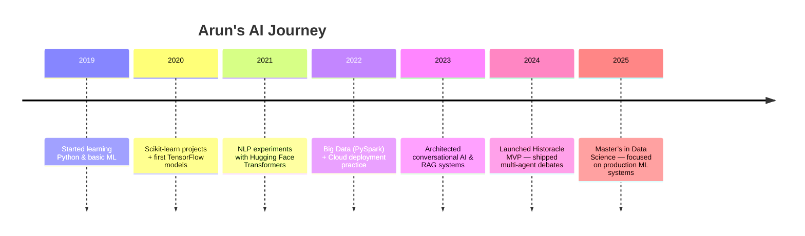

# 👋 Arun Kashyap — AI Engineer & Data Scientist

  

## 🚀 Quick Intro
**Arun Kashyap** — I build scalable AI products, ship ML systems, and turn messy data into actionable intelligence. Founder of **Historacle**, creator of conversational & generative AI experiences, and a relentless tinkerer with models, pipelines, and product UX.

- 🔭 Currently: Improving Historacle’s LLM stack and product performance
- 🎓 Education: M.S. in Data Science (2025)
- 📫 Email: `hvarunkashyap@gmail.com` • [LinkedIn](https://www.linkedin.com/in/hv-arunkashyap/)

---

## ✨ Highlights (quick receipts)
- Built production conversational AI systems (RAG, LLM orchestration, multi-agent debates)
- Deployed ML pipelines on **AWS** and **GCP** with CI/CD and monitoring
- Worked on high-scale AML detection using big-data architectures
- Built a RoBERTa-based mental-health chatbot and an AI fitness tracker

---

## 🧭 AI Journey — Timeline

---

## 🚀 Featured Projects (interactive cards)

  
  

  
  

---

## 📊 GitHub Activity & Metrics

  

  

---

## 🧰 Skills & Tooling

  

**Areas:** Deep learning, NLP, LLM systems, RAG, model fine-tuning, prompt engineering, data engineering, MLOps, model monitoring.

---

## 🤝 Connect

  
  

---

*README generated with love, sarcasm, and a caffeine dependency.*
